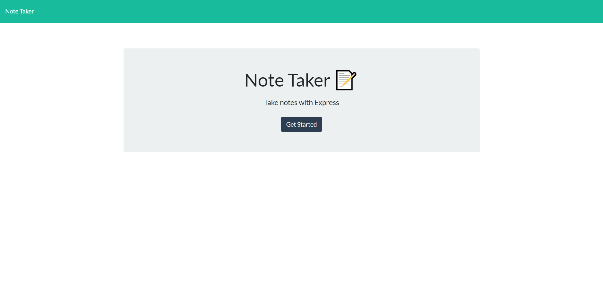
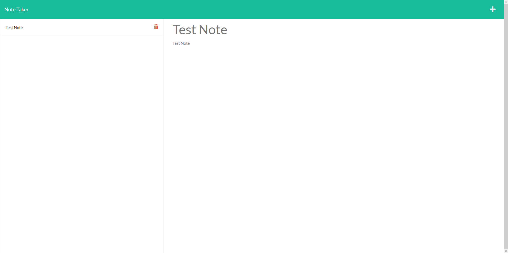

# Note Taker

  ## Description
  
  This application uses the Node module Express.js to GET POST and DELETE from a local JSON file.

  ## Table of Contents

  - [Preview](#preview)

  - [Installation](#installation)

  - [Usage](#usage)

  - [Credits](#credits)

  - [License](#license)

  - [Contact Me](#contact)
  
  ## Preview

  

  
  
  Link to the application https://gentle-crag-77895.herokuapp.com/
  
  ## Installation
  
  In the terminal use "npm i" to download required modules
  
  ## Usage
  
  Go to the Heroku link in the preview section for the deployed website.

  If you want to run it locally, open the folder containing everything in a console and run "npm start".
  Alternatively, if you have Nodemon installed globally you can just run "nodemon".
  After the server is started, navigate to "localhostL3001" in your browser and you should be able to start taking notes.
  
  ## Credits
  
  Jordan
  
  ## License
  
  
  
  ## Contact
  
  GitHub: jkstone321

  Email: jkstone321@gmail.com

